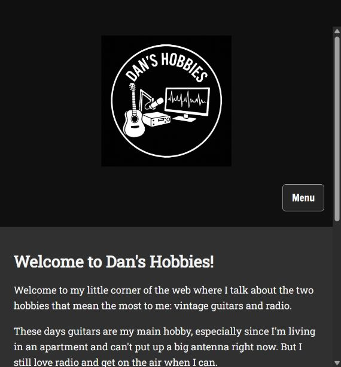

# Dan's Hobbies

A personal website about vintage Martin guitars and amateur radio, created by **Daniel Pena Arias** as a final web development project.



## Overview

Seven pages tell the story of my guitar collection, explain my interest in older Martin guitars, and introduce my radio background. The project uses HTML, CSS, and vanilla JavaScript without a framework or build step.

## Features

- Guitar collection with photos, individual stories, and jump links.
- Purchase and ownership timeline with a horizontally scrollable table on small screens.
- Responsive navigation with keyboard support and an active-page indicator.
- Skip-to-content links, descriptive image text, and visible keyboard focus.
- Optimized photos, lazy loading, and a print stylesheet.

## Run locally

Open `index.html` in a browser, or serve this folder with Python:

```sh
python -m http.server 8000
```

Then visit `http://localhost:8000`. No package installation is needed. Google Fonts requires an internet connection; local fallback fonts are specified.

## Project structure

```text
index.html                       Home
guitars.html                     Guitar collection
timeline.html                    Ownership timeline
why-an-old-martin-guitar.html     Vintage Martin story
radio.html                       Radio background
contact.html                     Public portfolio introduction
sitemap.html                     Page directory
css/styles.css                   Shared styling
scripts/script.js                Responsive navigation
images/                          Site images
docs/                            Screenshots and project notes
```

## Development and attribution

The original final project was created in December 2025 and subsequently updated. The September 2026 portfolio preparation includes ChatGPT-assisted accessibility, layout, image, and documentation improvements.

See [CREDITS.md](CREDITS.md) and [portfolio changes](docs/CHANGES.md).

## Deployment

This is a static site. The HTML files and asset folders can be served directly. The repository includes `.nojekyll` for GitHub Pages compatibility. Source repository: https://github.com/danpena27/dans-hobbies.
